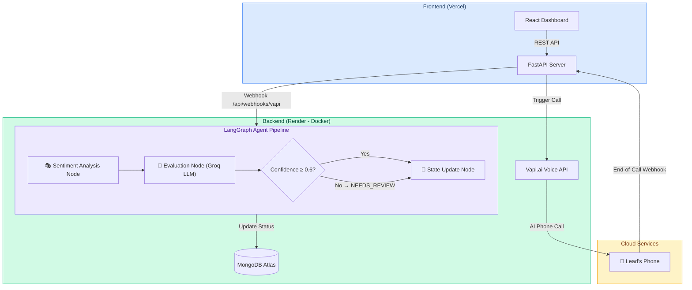

# 🚀 Multi-Tenant Agentic Voice Orchestrator

An end-to-end cloud-native SaaS for real estate agencies (and other tenants) to automate outbound lead qualification using AI voice agents. 

Built using **FastAPI, LangGraph, MongoDB, Vapi AI, and React + Tailwind CSS**.

**Live Demo:**
- 🌐 Frontend: https://voice-ai-orchestrator.vercel.app/
- ⚙️ Backend API: https://voice-ai-orchestrator.onrender.com
- 📹 Demo Video: https://drive.google.com/file/d/1PUZsjYbXhfiW3QRTQrSBHKbsuvD9ynGs/view?usp=sharing

---

## 🏗️ System Architecture



---

## 🌟 Features & Architecture

### 1. Multi-Tenant Architecture
- Supports multiple tenants (e.g., *Dream Homes Realty*, *City Rentals LLC*) from a single database.
- Each tenant has custom AI prompt instructions and isolated lead pools.
- **MongoDB** is used for persistent storage of Companies, Customers (Leads), and Call Logs.
- Pre-seeded with **2 companies and 5 realistic leads each** (10 total).

### 2. Vapi.ai Outbound Calling & Dynamic Prompting
- Automatically initiates outbound calls through the Vapi REST API.
- **✨ Bonus (Dynamic Prompting):** The backend dynamically constructs the AI assistant's system prompt right before dialing, securely injecting the tenant's exact instructions and the lead's name. No hard-coded prompts required in the Vapi dashboard!

### 3. Advanced LangGraph Agent Pipeline
Our orchestration brain is built using **LangGraph** with a sophisticated 4-node stateful graph:

| Node | Purpose |
|------|---------|
| **🎭 Sentiment Analysis** | Analyzes the emotional tone of the conversation transcript (POSITIVE / NEUTRAL / NEGATIVE) before evaluation |
| **🧠 Evaluation** | Passes the transcript + sentiment context to an LLM using **Structured Outputs** to extract intent, confidence score (0.0–1.0), and final status |
| **⚖️ Confidence Check** | Conditional routing: If confidence < 0.6, automatically sets status to `NEEDS_REVIEW` (human-in-the-loop fallback) |
| **📝 State Update** | Persists the final status, reasoning, sentiment, and confidence score to MongoDB |

**✨ Bonus (Human-in-the-Loop):** Low-confidence evaluations are flagged for human review rather than blindly categorized.

### 4. Ultra-Premium React Dashboard
- Built with React, Vite, Tailwind CSS v4, and Lucide Icons.
- Features **Glassmorphism design**, beautiful gradient backgrounds, and micro-animations.
- **3 full pages:** Campaigns Dashboard, Agent Configuration, and Call Transcript Logs.
- **Analytics cards** with animated counters showing conversion rates.
- **Auto-polling** during active campaigns (refreshes every 5 seconds).
- **Lead detail modal** with full contact information.
- **Call logs viewer** with expandable transcripts, sentiment badges, and AI confidence bars.

### 5. Cloud-Native Deployment
- **Dockerized backend** deployed to Render.
- **React frontend** deployed globally via Vercel CDN.
- **Infrastructure-as-code** with `deploy.sh` script for GCP Cloud Run.
- **✨ Bonus (IaC):** Automated deployment via shell script for reproducible builds.

---

## 🛠️ Local Setup & Testing

### Prerequisites
- Python 3.11+ and Node.js 18+
- MongoDB Atlas account (free M0 tier) or Docker for local MongoDB

### 1. Set Up Environment Variables
```bash
cp .env.example .env
```
Open `.env` and fill in your credentials:
| Variable | Description |
|----------|-------------|
| `MONGODB_URI` | Your MongoDB Atlas connection string |
| `GROQ_API_KEY` | Free API key from [console.groq.com](https://console.groq.com) |
| `OPENAI_API_KEY` | *(Optional)* Falls back to Groq if not set |
| `VAPI_API_KEY` | Your private Vapi.ai API Key |
| `VAPI_PHONE_NUMBER_ID` | The ID of your Vapi outbound phone number |

### 2. Run Backend
```bash
cd backend
pip install -r requirements.txt
python main.py
```
The API will be available at `http://localhost:8000`.

### 3. Run Frontend
```bash
cd frontend
npm install
npm run dev
```
The dashboard will be available at `http://localhost:5173`.

### 4. Run via Docker Compose (Alternative)
```bash
docker-compose up --build
```
This spins up MongoDB + the backend in one command.

### 5. Testing the Full Workflow
1. Open the dashboard in your browser.
2. Select a tenant from the dropdown.
3. Click **"Launch Campaign"** — The dashboard will start auto-polling.
4. The backend triggers Vapi AI, which dials the leads.
5. Answer the call and have a conversation with the AI.
6. When you hang up, Vapi sends a webhook → LangGraph evaluates the transcript → The dashboard updates the status badge in real-time!

---

## ☁️ Cloud Deployment (Render + Vercel)

### 1. Backend Deployment (Render)
1. Push this repository to GitHub.
2. Go to **[Render](https://render.com/)** → New **Web Service** → Connect your repo.
3. Set Environment to **Docker** → Add Environment Variables:
   - `MONGODB_URI`, `GROQ_API_KEY`, `VAPI_API_KEY`, `VAPI_PHONE_NUMBER_ID`
4. Click **Deploy**. Copy the backend URL.

### 2. Frontend Deployment (Vercel)
1. Go to **[Vercel](https://vercel.com/)** → **Add New Project** → Select your repo.
2. Set **Root Directory** to `frontend`.
3. Add Environment Variable: `VITE_API_URL` = `https://your-backend.onrender.com/api`
4. Click **Deploy**!

### 3. Wire Up Vapi Webhook
- In your Vapi Dashboard → Phone Numbers → Server URL:
  `https://your-backend.onrender.com/api/webhooks/vapi`

---

## 📁 Project Structure

```
voice-ai-orchestrator/
├── backend/
│   ├── main.py          # FastAPI server with all API endpoints
│   ├── agent.py         # LangGraph 4-node agentic pipeline
│   ├── database.py      # MongoDB connection + seed data
│   ├── models.py        # Pydantic data models & enums
│   ├── vapi.py          # Vapi.ai outbound call integration
│   └── requirements.txt
├── frontend/
│   ├── src/
│   │   ├── App.jsx              # Main app with 3-tab navigation
│   │   ├── api.js               # Axios API client
│   │   └── components/
│   │       ├── Dashboard.jsx    # Campaign overview + analytics
│   │       ├── AgentsConfig.jsx # Agent prompt configuration
│   │       └── CallLogs.jsx     # Transcript viewer + sentiment
│   ├── vercel.json
│   └── vite.config.js
├── Dockerfile           # Production Docker container
├── docker-compose.yml   # Local development stack
├── deploy.sh            # GCP Cloud Run deployment script
└── README.md
```

---

## 🧪 API Endpoints

| Method | Endpoint | Description |
|--------|----------|-------------|
| `GET` | `/api/health` | Health check |
| `GET` | `/api/companies` | List all tenants |
| `GET` | `/api/customers/{company_id}` | Get leads for a tenant |
| `POST` | `/api/campaign/trigger` | Launch outbound campaign |
| `POST` | `/api/webhooks/vapi` | Vapi webhook receiver |
| `GET` | `/api/call-logs/{company_id}` | Get call transcripts |
| `GET` | `/api/analytics/{company_id}` | Get conversion analytics |

---

## ⚖️ How This Meets Evaluation Criteria

| Criteria (Weight) | How We Deliver |
|-------------------|---------------|
| **Cloud Deployment (25%)** | Dockerized backend on Render, frontend on Vercel CDN, secrets via environment variables, IaC via `deploy.sh` |
| **Agentic Logic (25%)** | 4-node LangGraph pipeline with sentiment analysis, structured LLM evaluation, confidence-based routing, and human-in-the-loop fallback |
| **Frontend UX (20%)** | Premium glassmorphism UI with 3 pages, analytics cards, auto-polling, modals, and animated status badges |
| **Execution & Integration (20%)** | End-to-end: Dashboard → FastAPI → Vapi Call → Webhook → LangGraph → MongoDB → Dashboard update |
| **Code Quality (10%)** | Clean project structure, comprehensive README, typed models, async/await throughout, proper error handling |
